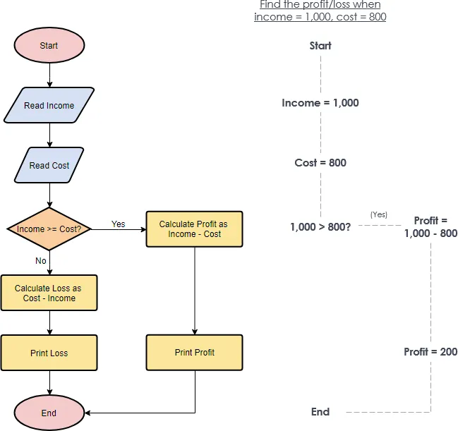

# Types of Operators

## 1. Arithmetic Operators

Arithmetic operators are used to perform mathematical operations. They consist of operands and operators.

### Operators:

- `+`, `-`, `*`, `/`, `%`, `**`, `++`, `--`

### Operands:

- Numbers like `1`, `2`, etc.

### 1.1 Addition Operator

- Performs addition of two or more operands.
- Used to add numbers:
  - Example: `10 + 20 + 30 + 40 + 50 = 150`
- Used to concatenate strings:
  - Example: `"Hello" + "World" = HelloWorld`

### 1.2 Subtraction Operator

- Performs subtraction of two or more operands.
- Used to subtract numbers:
  - Example: `100 - 50 - 25 = 25`
- Subtracting strings returns `NaN`:
  - Example: `"Hello" - "World" = NaN`

### 1.3 Multiplication Operator

- Performs multiplication of two or more operands.
- Used to multiply numbers:
  - Example: `10 * 20 * 30 = 6000`
- Multiplying strings returns `NaN`:
  - Example: `"Hello" * "World" = NaN`

### 1.4 Division Operator

- Performs division of two or more operands.
- Used to divide numbers:
  - Example: `100 / 50 / 2 = 1`
- Dividing strings returns `NaN`:
  - Example: `"Hello" / "World" = NaN`

### 1.5 Modulus Operator

- Finds the remainder of two or more operands.
- Used with numbers:
  - Example: `10 % 3 = 1`
  - Example: `10 % 3 % 2 = 1`
- Modulus with strings returns `NaN`:
  - Example: `"Hello" % "World" = NaN`

### 1.6 Exponential Operator

- Finds the power of two or more operands.
- Example: `2 ** 3 = 8`
- Example: `2 ** 3 ** 2 = 64`

### 1.7 Increment Operator

- Increments the value of a variable by `1`.
- Example:
  ```javascript
  let a = 10;
  a++; // 11
  ++a; // 12
  ```
- Types:
  1. **Pre-Increment Operator**: Increments the value before using it.
  2. **Post-Increment Operator**: Increments the value after using it.

### 1.8 Decrement Operator

- Decrements the value of a variable by `1`.
- Example:
  ```javascript
  let a = 10;
  a--; // 9
  --a; // 8
  ```

---

## 2. Assignment Operator

Assignment operators are used to assign values to variables.

### 2.1 Basic Assignment (`=`)

- Assigns a value to a variable.
- Example:
  ```javascript
  let b = 20; // Assigns 20 to b
  ```
  Note: The following assignment operators are used only with `let`. They are used to reassign a value to the same variable.

### 2.2 Add and Assign (`+=`)

- Adds a value to the variable and assigns the result to the same variable.
- Example:
  ```javascript
  let b = 20;
  b += 10; // Equivalent to b = b + 10
  console.log("b---->", b); // Output: 30
  ```

### 2.3 Subtract and Assign (`-=`)

- Subtracts a value from the variable and assigns the result to the same variable.
- Example:
  ```javascript
  let c = 15;
  c -= 10; // Equivalent to c = c - 10
  console.log("c---->", c); // Output: 5
  ```

### 2.4 Multiply and Assign (`*=`)

- Multiplies the variable by a value and assigns the result to the same variable.
- Example:
  ```javascript
  let d = 5;
  d *= 3; // Equivalent to d = d * 3
  console.log("d---->", d); // Output: 15
  ```

### 2.5 Divide and Assign (`/=`)

- Divides the variable by a value and assigns the result to the same variable.
- Example:
  ```javascript
  let e = 20;
  e /= 4; // Equivalent to e = e / 4
  console.log("e---->", e); // Output: 5
  ```

### 2.6 Modulus and Assign (`%=`)

- Finds the remainder when the variable is divided by a value and assigns the result to the same variable.
- Example:
  ```javascript
  let f = 10;
  f %= 3; // Equivalent to f = f % 3
  console.log("f---->", f); // Output: 1
  ```

## 3. Comparison Operator

Comparison operators are used to compare two values on the left-hand side and right-hand side.

### 3.1 Equal (`==`)

- Also known as double equal.
- It checks only the value, not the data type.
- If the values are the same but the data types are different, it will return `true`.
- Example:
  ```javascript
  console.log(20 == "20"); // true
  ```

### 3.2 Strict Equal (`===`)

- Also known as triple equal.
- It checks both the value and the data type.
- If the values are the same but the data types are different, it will return `false`.
- Example:
  ```javascript
  console.log(20 === "20"); // false
  ```

### Examples:

```javascript
console.log("--comparison two values--1--", 10 == 10); // true
console.log("--comparison two values--2--", 10 == "10"); // true
console.log("--comparison two values--3--", 4 == "10"); // false
console.log("--comparison two values--4--", "4" == "10"); // false
console.log("--comparison two values--5--", "Vinay" == "Vinay"); // true
console.log("--comparison two values--6--", "Vinay" == "vinay"); // false
console.log("--comparison two values--7--", "Vinay" === "vinay"); // false
console.log("--comparison two values--8--", "50" === "50"); // true
console.log("--comparison two values--9--", "501" === "50"); // false
console.log("--comparison two values--10--", true === 1); // false
console.log("--comparison two values--11--", true == 1); // true
console.log("--comparison two values--12--", null == 1); // false
console.log("--comparison two values--13--", null == false); // false
console.log("--comparison two values--14--", null == undefined); // true
console.log("--comparison two values--15--", false == false); // true
console.log("--comparison two values--16--", false == ""); // true

console.log("--comparison two values--17--", null === 1); // false
console.log("--comparison two values--18--", null === false); // false
console.log("--comparison two values--19--", null === undefined); // false
console.log("--comparison two values--20--", false === false); // true
console.log("--comparison two values--21--", false === ""); // false
```

### 3.3 Not Equal (`!=`) and Strict Not Equal (`!==`)

#### 3.3.1 Not Equal (`!=`)

- Compares two values for inequality, ignoring data type.
- Returns `true` if the values are not equal, otherwise `false`.

#### 3.3.2 Strict Not Equal (`!==`)

- Compares two values for inequality, considering data type.
- Returns `true` if the values or data types are not equal, otherwise `false`.

#### Examples:

```javascript
console.log("--comparison not equal two values--1--", 50 != 51); // true
console.log("--comparison not equal two values--2--", 50 != 50); // false
console.log("--comparison not equal two values--3--", 50 != "50"); // false
console.log("--comparison not equal two values--4--", "vinay" != "50"); // true
console.log("--comparison not equal two values--5--", "vinay" != "vinay"); // false
console.log("--comparison not equal two values--6--", "vinay" != "vInay"); // true
console.log("--comparison not equal two values--7--", 152 != "152"); // false
console.log("--comparison not equal two values--8--", "152" != "152"); // false
console.log("--comparison not equal two values--9--", 152 !== "152"); // true
console.log("--comparison not equal two values--10--", true != 1); // false
console.log("--comparison not equal two values--11--", true !== 1); // true
console.log("--comparison not equal two values--12--", true !== false); // true
console.log("--comparison not equal two values--13--", 10 + 20 == "10" + "20"); // false
console.log("--comparison not equal two values--14--", 10 + 20 == "10+20"); // false
console.log("--comparison not equal two values--15--", 10 + 20 !== "10+20"); // true
```

---

### 3.4 Greater Than (`>`) and Greater Than or Equal To (`>=`)

#### 3.4.1 Greater Than (`>`)

- Compares two values to check if the left-hand side is greater than the right-hand side.
- Returns `true` if the left-hand side is greater, otherwise `false`.

#### 3.4.2 Greater Than or Equal To (`>=`)

- Compares two values to check if the left-hand side is greater than or equal to the right-hand side.
- Returns `true` if the left-hand side is greater or equal, otherwise `false`.

#### Examples:

```javascript
// Greater Than
console.log("--comparison greater than --1--", 20 > 21); // false
console.log("--comparison greater than --2--", 20 > 20); // false
console.log("--comparison greater than --3--", 20 > "20"); // false
console.log("--comparison greater than --4--", 21 > "20"); // true
console.log("--comparison greater than --5--", 21 > "20Street"); // false
console.log("--comparison greater than --6--", "a" > "b"); // false
console.log("--comparison greater than --7--", "b" > "a"); // true
console.log("--comparison greater than --8--", "chandni" > "vinay"); // false
console.log("--comparison greater than --9--", "vinay" > "chandni"); // true
console.log("--comparison greater than --10--", "vinay" > "vijay"); // true
console.log("--comparison greater than --11--", 10 + 20 > 31); // false
console.log("--comparison greater than --12--", 10 + 20 > 31 - 10); // true
console.log("--comparison greater than --13--", 100 > 12 > 5); // false

// Greater Than or Equal To
console.log("--comparison greater than equal to--1--", 10 >= 9); // true
console.log("--comparison greater than equal to--2--", 10 >= 10); // true
console.log("--comparison greater than equal to--3--", "vinay" >= "vinay"); // true
console.log("--comparison greater than equal to--4--", "vinay" >= "vijay"); // true
console.log("--comparison greater than equal to--5--", "vijay" >= "vinay"); // false
console.log("--comparison greater than equal to--6--", true >= true); // true
console.log("--comparison greater than equal to--7--", 1 >= true); // true
console.log("--comparison greater than equal to--8--", 1 >= "1"); // true
console.log("--comparison greater than equal to--9--", false >= 0); // true
console.log("--comparison greater than equal to--10--", 10 + 20 >= 10 + 19); // true
console.log(
  "--comparison greater than equal to--11--",
  10 + 20 >= 10 + 19 > 10 + 21
); // false
console.log(
  "--comparison greater than equal to--12--",
  10 + 20 >= 10 + 19 == 60 - 1 > 10
); // true
```

---

### 3.5 Less Than (`<`) and Less Than or Equal To (`<=`)

#### 3.5.1 Less Than (`<`)

- Compares two values to check if the left-hand side is less than the right-hand side.
- Returns `true` if the left-hand side is less, otherwise `false`.

#### 3.5.2 Less Than or Equal To (`<=`)

- Compares two values to check if the left-hand side is less than or equal to the right-hand side.
- Returns `true` if the left-hand side is less or equal, otherwise `false`.

#### Examples:

```javascript
// Less Than
console.log("--comparison less than --1--", 10 < 9); // false
console.log("--comparison less than --2--", 10 < 10); // false
console.log("--comparison less than --3--", "vinay" < "vinay"); // false
console.log("--comparison less than --4--", "vinay" < "vijay"); // false
console.log("--comparison less than --5--", "vijay" < "vinay"); // true
console.log("--comparison less than --6--", true < true); // false
console.log("--comparison less than --7--", 1 < true); // false
console.log("--comparison less than --8--", 1 < "1"); // false
console.log("--comparison less than --9--", false < 0); // false

// Less Than or Equal To
console.log("--comparison less than equal to--1--", 10 <= 9); // false
console.log("--comparison less than equal to--2--", 10 <= 10); // true
console.log("--comparison less than equal to--3--", "vinay" <= "vinay"); // true
console.log("--comparison less than equal to--4--", "vinay" <= "vijay"); // false
console.log("--comparison less than equal to--5--", "vijay" <= "vinay"); // true
console.log("--comparison less than equal to--6--", true <= true); // true
console.log("--comparison less than equal to--7--", 1 <= true); // true
console.log("--comparison less than equal to--8--", 1 <= "1"); // true
console.log("--comparison less than equal to--9--", false <= 0); // true
```

## 4. Logical Operator

Logical operators are used to combine or invert boolean expressions. Below are examples and explanations of the three main logical operators: `&&` (AND), `||` (OR), and `!` (NOT).

### 4.1 Truth Table for Logical Operators

Logical operators are used to combine two or more conditions. Below is a truth table for the common logical operators.

#### 4.1.1 Logical AND (`&&`)

| Operand 1 | Operand 2 | Result (`Operand 1 && Operand 2`) |
| --------- | --------- | --------------------------------- |
| `true`    | `true`    | `true`                            |
| `true`    | `false`   | `false`                           |
| `false`   | `true`    | `false`                           |
| `false`   | `false`   | `false`                           |

#### 4.1.2 Logical OR (`||`)

| Operand 1 | Operand 2 | Result (`Operand 1 |     | Operand 2`) |
| --------- | --------- | ------------------ | --- | ----------- |
| `true`    | `true`    | `true`             |
| `true`    | `false`   | `true`             |
| `false`   | `true`    | `true`             |
| `false`   | `false`   | `false`            |

#### 4.1.3 Logical NOT (`!`)

| Operand | Result (`!Operand`) |
| ------- | ------------------- |
| `true`  | `false`             |
| `false` | `true`              |

---

### 4.2 Logical NOT (`!`)

The `!` operator inverts the boolean value of its operand. If the operand is `true`, it returns `false`, and vice versa.

```javascript
console.log("logical not--1--", !true); // false
console.log("logical not--2--", !false); // true
console.log("logical not--3--", !"chandni"); // false (non-empty strings are truthy)
console.log("logical not--4--", !Boolean("chandni")); // !true --> false
console.log("logical not--5--", !Boolean("null")); // !true --> false (non-empty strings are truthy)
console.log("logical not--6--", !Boolean(null)); // !false --> true (null is falsy)
console.log("logical not--7--", !0); // true (0 is falsy)
```

---

#### 4.3. Logical AND (`&&`)

The `&&` operator returns `true` if **both** operands are `true`. Otherwise, it returns `false`. If the first operand is falsy, it short-circuits and returns the first operand.

```javascript
console.log("logical AND--1--", true && true); // true
console.log("logical AND--2--", true && false); // false
console.log("logical AND--3--", false && false); // false
console.log("logical AND--4--", false && true); // false
console.log("logical AND--5--", !false && true); // true && true -> true
console.log("logical AND--6--", null && true); // null (short-circuits at null)
console.log("logical AND--7--", Boolean(null) && true); // false
console.log("logical AND--8--", undefined && true); // undefined (short-circuits at undefined)
console.log("logical AND--9--", !Boolean(undefined) && true); // !false && true ==> true && true --> true
```

---

#### 4.4 Logical OR (`||`)

The `||` operator returns `true` if **at least one** operand is `true`. If the first operand is truthy, it short-circuits and returns the first operand.

```javascript
console.log("logical OR--1--", true || true); // true
console.log("logical OR--2--", true || false); // true
console.log("logical OR--3--", false || false); // false
console.log("logical OR--4--", false || true); // true
console.log("logical OR--5--", !false || true); // true
console.log("logical OR--6--", null || true); // true (short-circuits at true)
console.log("logical OR--7--", Boolean(null) || true); // true
console.log("logical OR--8--", undefined || true); // true (short-circuits at true)
console.log("logical OR--9--", !Boolean(undefined) || true); // true
```

---

### 4.5 Key Points:

1. **Logical NOT (`!`)**: Inverts the boolean value of its operand.
2. **Logical AND (`&&`)**: Returns `true` only if both operands are `true`. Short-circuits if the first operand is falsy.
3. **Logical OR (`||`)**: Returns `true` if at least one operand is `true`. Short-circuits if the first operand is truthy.

---

## 5. Bitwise Operator

### No need to learn this operator in detail. Just know that it is used to perform bitwise operations on binary numbers.

- Bitwise operators are used to perform operations on binary representations of numbers.
- They operate on the binary digits (bits) of numbers and return a new number based on the operation performed.
- Bitwise operators are not commonly used in modern JavaScript programming, but they can be useful in certain scenarios, such as low-level programming or performance optimization.
- The following are the most commonly used bitwise operators:
  1. **Bitwise AND (`&`)**: Compares each bit of two numbers and returns a new number with bits set to `1` where both bits are `1`.
  2. **Bitwise OR (`|`)**: Compares each bit of two numbers and returns a new number with bits set to `1` where at least one bit is `1`.
  3. **Bitwise XOR (`^`)**: Compares each bit of two numbers and returns a new number with bits set to `1` where the bits are different.
  4. **Bitwise NOT (`~`)**: Inverts the bits of a number, changing `0`s to `1`s and `1`s to `0`s.
  5. **Left Shift (`<<`)**: Shifts the bits of a number to the left by a specified number of positions, filling the rightmost bits with `0`s.
  6. **Right Shift (`>>`)**: Shifts the bits of a number to the right by a specified number of positions, preserving the sign bit (the leftmost bit).
  7. **Zero-fill Right Shift (`>>>`)**: Shifts the bits of a number to the right by a specified number of positions, filling the leftmost bits with `0`s.

## 6. Ternary Operator

### briefly explain the ternary operator and its syntax.

    - The ternary operator is a shorthand way to write an `if-else` statement in JavaScript.
    - It takes three operands: a condition, a value if the condition is true, and a value if the condition is false.
    - The syntax is as follows:

```javascript
condition ? valueIfTrue : valueIfFalse;
```

    - If the condition evaluates to `true`, the expression returns `valueIfTrue`; otherwise, it returns `valueIfFalse`.

- Example:
  ```javascript
  const age = 18;
  const canVote = age >= 18 ? "Yes" : "No";
  console.log("Can vote:", canVote); // Output: "Can vote: Yes"
  ```
  - The ternary operator is often used for conditional assignments or to return values based on conditions in a concise manner.

## 7. Type Operator

### briefly explain the type operator and its syntax.

### 7.1 typeof operator is used to determine the data type of a variable or value in JavaScript. It returns a string indicating the type of the operand.

- The syntax is as follows:

  ```javascript
  typeof true; // "boolean";
  typeof 10; // "number";
  typeof "Hello"; // "string";
  typeof null; // "object"; (this is a known quirk in JavaScript)
  typeof undefined; // "undefined";
  typeof []; // "object"; (arrays are considered objects in JavaScript)
  typeof {}; // "object"; (objects are also considered objects in JavaScript)
  typeof function () {}; // "function"; (functions are a special type of object)
  typeof NaN; // "number"; (NaN is considered a number in JavaScript)
  ```

  ### 7.2 instanceof operator is used to check if an object is an instance of a specific constructor or class. It returns `true` or `false`.

  example:

  ```javascript
  const arr = [1, 2, 3];
  console.log(arr instanceof Array); // true (arr is an instance of Array)
  console.log(arr instanceof Object); // true (arr is also an instance of Object)
  console.log(arr instanceof String); // false (arr is not an instance of String)
  console.log(arr instanceof Number); // false (arr is not an instance of Number)
  ```

  class based example:

  ```javascript
  class Person {
    constructor(name) {
      this.name = name;
    }
  }
  const john = new Person("John");
  console.log(john instanceof Person); // true (john is an instance of Person)
  console.log(john instanceof Object); // true (john is also an instance of Object)
  console.log(john instanceof Array); // false (john is not an instance of Array)
  ```

## 8. Nullish Operator

- (`??`)
- Use ?? when you want to handle only null or undefined.
- Do not confuse ?? with ||. The || operator considers all falsy values (0, false, "", null, undefined, etc.), while ?? only - considers null and undefined.

## 9. Spread and Rest Operator

spread operator is used to expand or spread elements of an iterable (like an array or object) it is widely used to make copy or clone of an array or object.

- The syntax is as follows:

```javascript
const arr1 = [1, 2, 3];
const arr2 = [...arr1]; // Spread operator to copy arr1 into arr2
console.log(arr2); // Output: [1, 2, 3]
```

rest operator is used to collect multiple elements into a single array. It is often used in function parameters to handle an indefinite number of arguments.

- The syntax is as follows:

```javascript
const printColors = (clr1, ...clrs) => {
  console.log(" printing colors--", clrs); // clr1 will contain the first color,
  // and clrs will contain the rest of the colors as an array
};

printColors("red", "blue", "black", "yellow");

// rest operator example with array destructuring
const [clr1, clr2, ...remClrs] = ["red", "blue", "black", "yellow"];
console.log("clr1-->", clr1); // red
console.log("clr2-->", clr2); // blue
console.log("remClrs-->", remClrs); // [black, yellow]
```

## 10. Optional Chaining Operator

### Optional Chaining Operator

The optional chaining operator (`?.`) allows you to safely access deeply nested properties of an object without having to check if each reference in the chain is `null` or `undefined`. If a reference is `null` or `undefined`, the expression short-circuits and returns `undefined` instead of throwing an error.

#### Syntax:

```javascript
object?.property;
object?.[expression];
object?.method();
```

#### Examples:

1. Accessing a nested property:

```javascript
const user = {
  profile: {
    name: "John",
  },
};

console.log(user?.profile?.name); // Output: "John"
console.log(user?.address?.city); // Output: undefined (no error)
```

2. Accessing a method:

```javascript
const user = {
  greet: () => "Hello!",
};

console.log(user?.greet?.()); // Output: "Hello!"
console.log(user?.sayGoodbye?.()); // Output: undefined (no error)
```

3. Using with arrays:

```javascript
const users = [{ name: "Alice" }, null, { name: "Bob" }];

users.forEach((user) => {
  console.log(user?.name); // Output: "Alice", undefined, "Bob"
});
```

#### Key Points:

- Use `?.` to avoid runtime errors when accessing properties or methods of objects that might be `null` or `undefined`.
- It does not work for non-existent variables; the variable itself must be declared.
- It is particularly useful when working with APIs or data structures where some fields may be optional or missing.
- Avoid overusing it, as it can mask potential bugs in your code.

## Types of Functions

1. **Function Declaration**

   - Not recommended to use in modern JavaScript.
   - It is hoisted and can be called before it is defined.

2. **Function Expression**

   - It is not hoisted and can only be called after it is defined.

3. **Arrow Function**

   - Also called fat arrow function or function expression.

4. **Function with Default Parameter**

   - Allows setting default values for function parameters.

5. **Strict Function**

   - Functions that operate in strict mode.

6. **Function with Rest Parameter**
   - Allows handling an indefinite number of arguments as an array.

### Examples of Functions in JavaScript

#### 1. Function Declaration

Function declarations are hoisted, meaning they can be called before they are defined.

```javascript
console.log(add(10, 40)); // 50

function add(a, b) {
  return a + b;
}
console.log(add(10, 20)); // 30
```

#### 2. Function Expression

Function expressions are not hoisted and can only be called after they are defined.

```javascript
// console.log('addTwoNumber before function call--', addTwoNumber(10, 40));
// Uncaught ReferenceError: Cannot access 'addTwoNumber' before initialization

const addTwoNumber = function (a, b) {
  return a + b;
};
console.log("addTwoNumber--", addTwoNumber(10, 20)); // 30
```

#### 3. Arrow Function

Arrow functions are a shorter syntax for writing function expressions. They are not hoisted and are a feature of ES6.

```javascript
// console.log('addTwoNumberArrow before function call--', addTwoNumberArrow(10, 40));
// Uncaught ReferenceError: Cannot access 'addTwoNumberArrow' before initialization

const addTwoNumberArrow = (a, b) => {
  console.log("addTwoNumberArrow- checking parameters-", a, b); // 10, 20
  return a + b;
};
console.log("addTwoNumberArrow--", addTwoNumberArrow(10, 20)); // 30
console.log("addTwoNumberArrow without value--", addTwoNumberArrow(10)); // NaN
```

#### 4. Arrow Function with Default Parameters

Default parameters allow setting default values for function arguments. This is a feature of ES6.

```javascript
const addTwoNumberArrowWithDefault = (a = 0, b = 0) => {
  console.log("addTwoNumberArrow- checking parameters-", a, b); // 10, 20
  return a + b;
};
console.log("addTwoNumberArrowWithDefault--", addTwoNumberArrowWithDefault(10)); // 10
console.log(
  "addTwoNumberArrowWithDefault-2---",
  addTwoNumberArrowWithDefault(30)
); // 30
console.log(
  "addTwoNumberArrowWithDefault-3---",
  addTwoNumberArrowWithDefault()
); // 0
```

#### 5. Strict Function

Strict functions enforce stricter parsing and error handling in JavaScript. Below is an example of a function using default parameters and strict mode.

```javascript
const calculateMarks = ({ eng = 0, phy = 0, chem = 0 }) => {
  console.log(
    `This student has marks in English: ${eng}, Physics: ${phy}, Chemistry: ${chem}`
  );
  return eng + phy + chem;
};

const phy = 64;
const chem = 73;
const english = 89;

console.log(
  "Calculating marks of student Chandni--",
  calculateMarks({ phy: phy, chem: chem, eng: english })
);
console.log(
  "Calculating marks of student Vinay--",
  calculateMarks({ eng: english, phy: phy, chem })
); // shorthand property
```

## JavaScript Default Popups

JavaScript provides built-in popup methods to interact with users. These include `alert`, `confirm`, and `prompt`.

### 1. Alert

- Used to display a message to the user.
- Example:
  ```javascript
  alert("You have a few unsaved changes. Do you want to save them?");
  ```

### 2. Confirm

- Used to display a message to the user and ask for confirmation.
- Returns `true` or `false` based on user input.
- Examples:

  ```javascript
  confirm("You have a few unsaved changes. Do you want to save them?");
  ```

  ```javascript
  const userConfirmation1 = confirm("Do you want to proceed?");
  console.log("User confirmation for proceed:", userConfirmation1);

  const userConfirmation2 = confirm(
    "Are you sure you want to delete this item?"
  );
  console.log("User confirmation for delete:", userConfirmation2);

  const userConfirmation3 = confirm(
    "Do you agree to the terms and conditions?"
  );
  console.log("User confirmation for terms and conditions:", userConfirmation3);
  ```

### 3. Prompt

- Used to display a message to the user and ask for input.
- Returns the input value as a string or `null` if canceled.
- Example:

  ```javascript
  const userName = prompt("Please enter your name:"); // It will display a message to the user and ask for input
  console.log("User name:", userName); // It will return the input value as a string or null. we can store the value in a variable

  const physicsMarks = prompt("Please enter your physics marks:"); // It will display a message to the user and ask for input
  console.log("Physics marks:", physicsMarks, Number(physicsMarks)); // It will return the input value as a string or null. we can store the value in a variable
  ```

- Note: The value returned by `prompt` can be stored in a variable for further use.

### Example: Function to Calculate Student Marks

The following code demonstrates how to create a function that takes a student's name and their marks in English, Physics, and Chemistry, and outputs a formatted string with their total marks.

#### Code:

```javascript
/**
 * Create a function that takes input of student name and their marks in English, Physics, and Chemistry.
 * The output would be like this:
 * OUTPUT: This studentName has marks in English 89, Physics 64, Chemistry 73, and total marks 226.
 */

const studentName = prompt("Please Enter Student Name:"); // Prompt user for student name
const englishMarks = prompt("Please Enter English Marks:"); // Prompt user for English marks
const physicsMarks = prompt("Please Enter Physics Marks:"); // Prompt user for Physics marks
const chemistryMarks = prompt("Please Enter Chemistry Marks:"); // Prompt user for Chemistry marks

// Function using basic parameters
const getStudentMarks = (stName, eng, phy, chem) => {
  const sumOfMarks = eng + phy + chem;
  return `${stName} has marks in English ${eng}, Physics ${phy}, Chemistry ${chem}, and total marks ${sumOfMarks}`;
};

// Example usage:
// console.log(getStudentMarks(studentName, Number(englishMarks), Number(physicsMarks), Number(chemistryMarks)));

// Function with default parameters
const getStudentMarksWithDef = (stName = "", eng = 0, phy = 0, chem = 0) => {
  const sumOfMarks = eng + phy + chem;
  return `${stName} has marks in English ${eng}, Physics ${phy}, Chemistry ${chem}, and total marks ${sumOfMarks}`;
};

console.log(
  "getStudentMarksWithDef-1:",
  getStudentMarksWithDef(
    studentName,
    Number(englishMarks),
    Number(physicsMarks)
  )
); // When all arguments are not passed
console.log(
  "getStudentMarksWithDef-2:",
  getStudentMarksWithDef(
    Number(englishMarks),
    Number(physicsMarks),
    studentName
  )
); // When arguments are not relocated

// Strict function with default parameters
const getStudentMarksWithStrict = ({
  stName = "",
  eng = 0,
  phy = 0,
  chem = 0,
}) => {
  const sumOfMarks = eng + phy + chem;
  return `${stName} has marks in English ${eng}, Physics ${phy}, Chemistry ${chem}, and total marks ${sumOfMarks}`;
};

console.log(
  "getStudentMarksWithStrict-1:",
  getStudentMarksWithStrict({
    eng: Number(englishMarks),
    phy: Number(physicsMarks),
    stName: studentName,
    chem: Number(chemistryMarks),
  })
); // When arguments are passed in any order

console.log(
  "getStudentMarksWithStrict-2:",
  getStudentMarksWithStrict({
    eng: Number(englishMarks),
    chem: Number(chemistryMarks),
  })
); // When some arguments are missing
```

#### Explanation:

1. **Basic Function**: `getStudentMarks` takes four arguments (name, English marks, Physics marks, Chemistry marks) and calculates the total.
2. **Function with Default Parameters**: `getStudentMarksWithDef` provides default values for missing arguments.
3. **Strict Function**: `getStudentMarksWithStrict` uses an object as a parameter, allowing arguments to be passed in any order.

#### Example Output:

- Input:
  - Student Name: `John`
  - English Marks: `89`
  - Physics Marks: `64`
  - Chemistry Marks: `73`
- Output:  
  `John has marks in English 89, Physics 64, Chemistry 73, and total marks 226.`

---

# Decision making

## Decision Making in JavaScript

Decision making in JavaScript involves executing different blocks of code based on certain conditions. It allows the program to make choices and control the flow of execution. Common decision-making statements include `if`, `if-else`, `if-else if`, and `switch`.

### Key Decision-Making Statements:

1. **`if` Statement**: Executes a block of code if a specified condition is `true`.
2. **`if-else` Statement**: Executes one block of code if the condition is `true`, and another block if it is `false`.
3. **`if-else if` Ladder**: Tests multiple conditions sequentially.
4. **`switch` Statement**: Evaluates an expression and executes code based on matching cases.

### Example:

```javascript
const age = 18;

if (age >= 18) {
  console.log("You are eligible to vote.");
} else {
  console.log("You are not eligible to vote.");
}
```

This example checks if the `age` is 18 or above and prints a message accordingly.

## Flow Chart for Decision Making:



# complex or nested decision making

- complex decision making is when we have multiple conditions to check and execute different blocks of code based on those conditions.

- A company insures its drivers in the following
  cases:
  − If the driver is married.
  − If the driver is unmarried, male & above 30 years of age.
  − If the driver is unmarried, female & above 25 years of age.
  In all other cases the driver is not insured. If the marital status, sex
  and age of the driver are the inputs, write a program to determine
  whether the driver is to be insured or not

- the following code is an example of complex decision making using if-else statements.
- here added validations for employee insurance eligibility based on various conditions such as
- age
- marital status
- gender
- the code checks if the employee is married or not and if not, it checks the age

```js
const employeeInsurance = ({
  empName = "",
  isMarried = false,
  age = 0,
  gender = "",
}) => {
  console.log("-----------------------------", gender);

  // validations
  // 1. empName , age, gender must be entered
  if (!Boolean(empName)) {
    // empName must be entered
    console.warn(`Please enter a valid name`);
    return;
  } else if (!age || age <= 0) {
    // age must be 18+
    console.warn(`${age} is nat a valid age.`);
    return;
  } else if (age <= 18) {
    // age must be 18+
    console.warn(
      `${empName} is underage with age of ${age}. Employee must be 18+`
    );
    return;
  } else if (age > 60) {
    // age must be 60 or less
    console.warn(
      `${empName} is overage with age of ${age}. Employee must be 60-`
    );
    return;
  } else if (!Boolean(gender)) {
    console.warn(`Please enter a valid gender (m or f)`);
    return;
  } else if (
    gender.length > 0 &&
    gender.toLowerCase() !== "m" &&
    gender.toLowerCase() !== "f"
  ) {
    console.warn(`Please enter a valid gender (m or f) --2`);
    return;
  }

  console.log(
    `${empName} with age of ${age}, gender is ${gender}. This employee is married ${isMarried}`
  );

  if (isMarried == true) {
    // if married, eligible for insurance
    console.log(`${empName} is eligible for insurance`);
  } else if (isMarried == false && gender.toLowerCase() == "m" && age > 30) {
    // if unmarried, male and age > 30, eligible for insurance
    console.log(`${empName} is eligible for insurance`);
  } else if (isMarried == false && gender.toLowerCase() == "f" && age > 25) {
    // if unmarried, female and age > 25, eligible for insurance
    console.log(`${empName} is eligible for insurance`);
  } else {
    // if none of the above conditions are met, not eligible for insurance
    console.log(`${empName} is NOT eligible for insurance`);
  }
};
```

# ternary operator

- The ternary operator is a shorthand way to write an `if-else` statement in JavaScript.
- It takes three operands: a condition, a value if the condition is true, and a value if the condition is false.
- The syntax is as follows:

```javascript
condition ? valueIfTrue : valueIfFalse;

// condition ? true case : false case
num % 2 == 0
  ? console.log("This is a even number")
  : console.log("This is a odd number");
```

## complex decision making using ternary operator

- If the ages of Sanjay, Vijay and Ajay are input through the keyboard, write a program to determine the youngest of the three.

```js
const whoIsYoungest = () => {
  // --- input--
  // get the ages of Sanjay, Vijay and Ajay from user input

  const Sanjay = Number(prompt("Enter Sanjay's Age"));
  const Vijay = Number(prompt("Enter Vijay's Age"));
  const Ajay = Number(prompt("Enter Ajay's Age"));
  console.log(
    `Age of Sanjay- ${Sanjay}, Age of Vijay ${Vijay} and age of Ajay ${Ajay}`
  );

  // -- validation--
  // check if the ages are valid numbers
  if (isNaN(Sanjay) || isNaN(Vijay) || isNaN(Ajay)) {
    console.warn(
      `Please enter valid age of ${
        isNaN(Sanjay) ? "Sanjay" : isNaN(Vijay) ? "Vijay" : "Ajay"
      }`
    );
    return;
  }

  // --- if-else statement---
  // if (Sanjay < Vijay && Sanjay < Ajay) {
  //   console.log("Sanjay is Youngest -- if-else");
  // } else if (Vijay < Sanjay && Vijay < Ajay) {
  //   console.log("Vijay is Youngest -- if-else");
  // } else {
  //   console.log("Ajay is Youngest -- if-else");
  // }

  // --- ternary operator---
  Sanjay < Vijay && Sanjay < Ajay
    ? console.log("Sanjay is Youngest")
    : Vijay < Sanjay && Vijay < Ajay
    ? console.log("Vijay is Youngest")
    : console.log("Ajay is Youngest");
};
```

---

## Switch Case in JavaScript

The `switch` statement is used to perform different actions based on different conditions. It is an alternative to using multiple `if-else` statements when you need to compare a single value against multiple possible cases.

### Syntax:

```javascript
switch (expression) {
  case value1:
    // Code to execute if expression === value1
    break;
  case value2:
    // Code to execute if expression === value2
    break;
  default:
  // Code to execute if no case matches
}
```

### Key Points:

1. The `switch` statement evaluates an expression and matches its value against the `case` values.
2. The `break` statement prevents the execution from falling through to the next case.
3. The `default` case is optional and executes if no other case matches.

### Example:

```javascript
const day = 3;

switch (day) {
  case 1:
    console.log("Monday");
    break;
  case 2:
    console.log("Tuesday");
    break;
  case 3:
    console.log("Wednesday");
    break;
  case 4:
    console.log("Thursday");
    break;
  case 5:
    console.log("Friday");
    break;
  case 6:
    console.log("Saturday");
    break;
  case 7:
    console.log("Sunday");
    break;
  default:
    console.log("Invalid day");
}
```

### Output:

```
Wednesday
```

### When to Use `switch`:

- Use `switch` when you need to compare a single value against multiple possible outcomes.
- It is particularly useful when there are many conditions, as it improves readability compared to multiple `if-else` statements.

### Example with Multiple Cases:

```javascript
const fruit = "apple";

switch (fruit) {
  case "apple":
  case "banana":
  case "cherry":
    console.log("This is a fruit.");
    break;
  default:
    console.log("Unknown item.");
}
```

### Output:

```
This is a fruit.
```

By using `switch`, you can simplify complex decision-making logic and make your code more readable.

## other example of switch case

```javascript
// ---------- Switch Case --------------
const dayName = "fri";

// Finding day with if-else
if (dayName == "sun") {
  console.log(" this is Sunday");
} else if (dayName == "mon") {
  console.log(" this is Monday");
} else if (dayName == "tues") {
  console.log(" this is Tuesday");
} else if (dayName == "wed") {
  console.log(" this is Wednesday");
} else if (dayName == "thur") {
  console.log(" this is Thursday");
} else if (dayName == "fri") {
  console.log(" this is Friday");
} else if (dayName == "sat") {
  console.log(" this is Saturday");
} else {
  console.log("No day has been matched");
}

// Finding day with switch case
switch (dayName) {
  case "sun":
    console.log(" this is Switch Sunday");
    break;
  case "mon":
    console.log("This is Switch Monday");
    break;
  case "tues":
    console.log("This is Switch Tuesday");
    break;
  case "wed":
    console.log("This is Switch Wednesday");
    break;
  case "thurs":
    console.log("This is Switch Thursday");
    break;
  case "fri":
    console.log("This is Switch Friday");
    break;
  case "sat":
    console.log("This is Switch Saturday");
    break;
  default:
    console.log("No day has been matched");
    break;
}
```

# for loop

## Looping

### 1. What is Looping in General Language?

Looping refers to the process of repeating a set of actions or tasks multiple times until a specific condition is met.

### 2. What is Looping in Programming Language?

In programming, looping is a technique used to execute a block of code repeatedly as long as a specified condition is true. It helps in automating repetitive tasks.

### 3. Use of Looping

- Automating repetitive tasks.
- Iterating over data structures like arrays or objects.
- Performing calculations or operations multiple times.
- Generating patterns or sequences.

### 4. Types of Looping

1. **For Loop**: Executes a block of code a specific number of times.
2. **While Loop**: Executes a block of code as long as a condition is true.
3. **Do-While Loop**: Executes a block of code at least once, then continues as long as a condition is true.
4. **For-In Loop**: Iterates over the properties of an object.
5. **For-Of Loop**: Iterates over the values of an iterable object like an array.

---

## For Loop

### 5. What is a For Loop?

A `for` loop is a control flow statement that allows code to be executed repeatedly based on a condition. It is commonly used when the number of iterations is known beforehand.

### 6. Simple Explanation of For Loop with Example

A `for` loop consists of three parts:

1. **Initialization**: Sets the starting point of the loop.
2. **Condition**: Specifies the condition to continue the loop.
3. **Increment/Decrement**: Updates the loop variable after each iteration.

#### Syntax:

```javascript
for (initialization; condition; increment / decrement) {
  // Code to execute
}
```

#### Example:

```javascript
for (let i = 1; i <= 5; i++) {
  console.log("Iteration:", i);
}
```

#### Output:

```
Iteration: 1
Iteration: 2
Iteration: 3
Iteration: 4
Iteration: 5
```

---

### 7. What is a Nested For Loop?

A nested `for` loop is a loop inside another loop. The inner loop executes completely for each iteration of the outer loop.

#### Example:

```javascript
for (let i = 1; i <= 3; i++) {
  for (let j = 1; j <= 2; j++) {
    console.log(`Outer Loop: ${i}, Inner Loop: ${j}`);
  }
}
```

#### Output:

```
Outer Loop: 1, Inner Loop: 1
Outer Loop: 1, Inner Loop: 2
Outer Loop: 2, Inner Loop: 1
Outer Loop: 2, Inner Loop: 2
Outer Loop: 3, Inner Loop: 1
Outer Loop: 3, Inner Loop: 2
```

---

#### 8.1 Right-Angled Triangle

```javascript
function rightAngledTriangle(rows) {
  for (let i = 1; i <= rows; i++) {
    let stars = "";
    for (let j = 1; j <= i; j++) {
      stars += "*";
    }
    document.write(stars + "<br />");
  }
}
rightAngledTriangle(5);
```

#### Output:

```
*
**
***
****
*****
```

#### 8.2 Inverted Right-Angled Triangle

```javascript
function invertedRightAngledTriangle(rows) {
  for (let i = rows; i >= 1; i--) {
    let stars = "";
    for (let j = 1; j <= i; j++) {
      stars += "*";
    }
    document.write(stars + "<br />");
  }
}
invertedRightAngledTriangle(5);
```

#### Output:

```
*****
****
***
**
*
```

#### 8.3 Pyramid

```javascript
function pyramid(rows) {
  for (let i = 1; i <= rows; i++) {
    let line = "";
    for (let j = 1; j <= rows - i; j++) {
      line += " ";
    }
    for (let k = 1; k <= 2 * i - 1; k++) {
      line += "*";
    }
    document.write(line + "<br />");
  }
}
pyramid(5);
```

#### Output:

```
    *
   ***
  *****
 *******
*********
```

#### 8.4 Inverted Pyramid

```javascript
function invertedPyramid(rows) {
  for (let i = rows; i >= 1; i--) {
    let line = "";
    for (let j = 1; j <= rows - i; j++) {
      line += " ";
    }
    for (let k = 1; k <= 2 * i - 1; k++) {
      line += "*";
    }
    document.write(line + "<br />");
  }
}
invertedPyramid(5);
```

#### Output:

```
*********
 *******
  *****
   ***
    *
```

#### 8.5 Diamond

```javascript
function diamond(rows) {
  for (let i = 1; i <= rows; i++) {
    let line = "";
    for (let j = 1; j <= rows - i; j++) {
      line += " ";
    }
    for (let k = 1; k <= 2 * i - 1; k++) {
      line += "*";
    }
    document.write(line + "<br />");
  }
  for (let i = rows - 1; i >= 1; i--) {
    let line = "";
    for (let j = 1; j <= rows - i; j++) {
      line += " ";
    }
    for (let k = 1; k <= 2 * i - 1; k++) {
      line += "*";
    }
    document.write(line + "<br />");
  }
}
diamond(5);
```

#### Output:

```
    *
   ***
  *****
 *******
*********
 *******
  *****
   ***
    *
```

#### 8.6 Square

```javascript
function square(rows) {
  for (let i = 1; i <= rows; i++) {
    let line = "";
    for (let j = 1; j <= rows; j++) {
      line += "*";
    }
    document.write(line + "<br />");
  }
}
square(5);
```

#### Output:

```
*****
*****
*****
*****
*****
```

#### 8.7 Hollow Square

```javascript
function hollowSquare(rows) {
  for (let i = 1; i <= rows; i++) {
    let line = "";
    for (let j = 1; j <= rows; j++) {
      if (i === 1 || i === rows || j === 1 || j === rows) {
        line += "*";
      } else {
        line += " ";
      }
    }
    document.write(line + "<br />");
  }
}
hollowSquare(5);
```

#### Output:

```
*****
*   *
*   *
*   *
*****
```

#### 8.8 Right-Angled Triangle with Numbers

```javascript
function rightAngledTriangleWithNumbers(rows) {
  for (let i = 1; i <= rows; i++) {
    let line = "";
    for (let j = 1; j <= i; j++) {
      line += j;
    }
    document.write(line + "<br />");
  }
}
rightAngledTriangleWithNumbers(5);
```

#### Output:

```
1
12
123
1234
12345
```

#### 8.9 Pascal's Triangle

```javascript
function pascalsTriangle(rows) {
  for (let i = 0; i < rows; i++) {
    let line = "";
    let num = 1;
    for (let j = 1; j <= rows - i; j++) {
      line += " ";
    }
    for (let k = 0; k <= i; k++) {
      line += num + " ";
      num = (num * (i - k)) / (k + 1);
    }
    document.write(line + "<br />");
  }
}
pascalsTriangle(5);
```

#### Output:

```
     1
    1 1
   1 2 1
  1 3 3 1
 1 4 6 4 1
```

#### 8.10 Checkerboard Pattern

```javascript
function checkerboardPattern(rows) {
  for (let i = 1; i <= rows; i++) {
    let line = "";
    for (let j = 1; j <= rows; j++) {
      if ((i + j) % 2 === 0) {
        line += "*";
      } else {
        line += " ";
      }
    }
    document.write(line + "<br />");
  }
}
checkerboardPattern(5);
```

#### Output:

```
* * * * *
 * * * * *
* * * * *
 * * * * *
* * * * *
```

---

# arrays

# objects

# object/array destructuring

# deep copy(clone)/shallow copy(clone)

# DOM manipulation

# events

# JSON

# AJAX

# promises

# async and await

# error handling

# try and catch

# debugging

# debugging tools

# browser developer tools

# performance optimization

# best practices

## coding standards

## code reviews

## code quality

# coding standards (best practices)

## what are coding standards?

- coding standards are a set of guidelines and best practices that developers follow to write clean, maintainable, and consistent code. They help ensure that code is easy to read, understand, and modify by other developers.
- examples of coding standards include naming conventions, indentation styles, and commenting practices.

## JavaScript Coding Standards

### 1. Use Descriptive Variable and Function Names

- Use meaningful and descriptive names for variables and functions to make the code self-explanatory.

#### Example:

```javascript
// Bad
let x = 10;
function fn(a, b) {
  return a + b;
}

// Good
let userAge = 10;
function calculateSum(num1, num2) {
  return num1 + num2;
}
```

---

### 2. Use `const` and `let` Instead of `var`

- Always use `const` for variables that won't be reassigned and `let` for variables that will.

#### Example:

```javascript
// Bad
var count = 10;

// Good
const maxUsers = 100;
let currentUsers = 10;
```

---

### 3. Use Strict Equality (`===`) Instead of Loose Equality (`==`)

- Avoid type coercion by using `===` and `!==`.

#### Example:

```javascript
// Bad
if (5 == "5") {
  console.log("Equal");
}

// Good
if (5 === "5") {
  console.log("Not Equal");
}
```

---

### 4. Use Template Literals for String Concatenation

- Use template literals instead of string concatenation for better readability.

#### Example:

```javascript
// Bad
const name = "John";
const greeting = "Hello, " + name + "!";

// Good
const name = "John";
const greeting = `Hello, ${name}!`;
```

---

### 5. Avoid Global Variables

- Minimize the use of global variables to prevent conflicts and unexpected behavior.

#### Example:

```javascript
// Bad
var globalVar = "I am global";

// Good
(function () {
  const localVar = "I am local";
  console.log(localVar);
})();
```

---

### 6. Use Arrow Functions for Anonymous Functions

- Use arrow functions for cleaner and more concise syntax.

#### Example:

```javascript
// Bad
const numbers = [1, 2, 3];
const squares = numbers.map(function (num) {
  return num * num;
});

// Good
const numbers = [1, 2, 3];
const squares = numbers.map((num) => num * num);
```

---

### 7. Add Comments to Explain Complex Logic

- Write comments to explain why certain logic is implemented, not what the code does.

#### Example:

```javascript
// Bad
let x = 10; // Assign 10 to x

// Good
// Calculate the total price including tax
const totalPrice = price + price * taxRate;
```

---

### 8. Use Consistent Indentation

- Use 2 or 4 spaces for indentation consistently throughout the code.

#### Example:

```javascript
// Bad
function add(a, b) {
  return a + b;
}

// Good
function add(a, b) {
  return a + b;
}
```

---

### 9. Avoid Magic Numbers

- Use constants or variables instead of hardcoding numbers.

#### Example:

```javascript
// Bad
if (score > 90) {
  console.log("Excellent");
}

// Good
const EXCELLENT_SCORE_THRESHOLD = 90;
if (score > EXCELLENT_SCORE_THRESHOLD) {
  console.log("Excellent");
}
```

---

### 10. Handle Errors Gracefully

- Use `try-catch` blocks to handle errors and avoid application crashes.

#### Example:

```javascript
// Bad
const data = JSON.parse(userInput);

// Good
try {
  const data = JSON.parse(userInput);
} catch (error) {
  console.error("Invalid JSON input:", error.message);
}
```

---

### 11. Avoid Deep Nesting

- Refactor deeply nested code for better readability.

#### Example:

```javascript
// Bad
if (user) {
  if (user.isActive) {
    if (user.role === "admin") {
      console.log("Welcome, Admin!");
    }
  }
}

// Good
if (user?.isActive && user.role === "admin") {
  console.log("Welcome, Admin!");
}
```

---

### 12. Use Default Parameters

- Use default parameters to handle missing arguments.

#### Example:

```javascript
// Bad
function greet(name) {
  const userName = name || "Guest";
  console.log(`Hello, ${userName}`);
}

// Good
function greet(name = "Guest") {
  console.log(`Hello, ${name}`);
}
```

---

### 13. Avoid Repetition (DRY Principle)

- Avoid duplicating code by creating reusable functions.

#### Example:

```javascript
// Bad
function calculateAreaOfSquare(side) {
  return side * side;
}

function calculateAreaOfRectangle(length, width) {
  return length * width;
}

// Good
function calculateArea(shape, ...dimensions) {
  if (shape === "square") return dimensions[0] ** 2;
  if (shape === "rectangle") return dimensions[0] * dimensions[1];
}
```

---

### 14. Use Meaningful Commit Messages

- When using version control, write clear and descriptive commit messages.

#### Example:

```bash
# Bad
git commit -m "Fix bug"

# Good
git commit -m "Fix issue where user data was not saving to the database"
```

---

### 15. Follow Naming Conventions

- Use camelCase for variables and functions, PascalCase for classes, and UPPER_CASE for constants.

#### Example:

```javascript
// Variables and Functions
let userAge = 25;
function calculateSum(a, b) {
  return a + b;
}

// Classes
class UserProfile {
  constructor(name) {
    this.name = name;
  }
}

// Constants
const MAX_USERS = 100;
```

By following these coding standards, you can write clean, maintainable, and professional JavaScript code.
